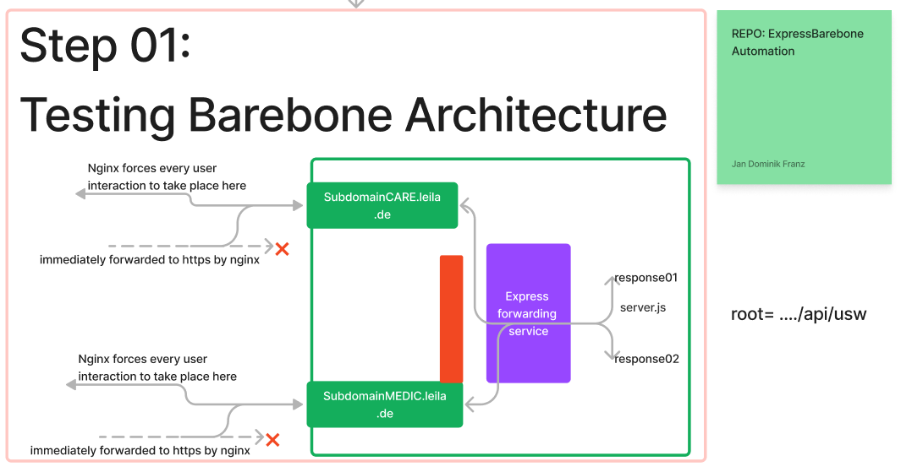

# Getting Started/How to use

every information that a 3rd party developer should know when first using this repository.

//TODO @Mohamed fill in the information a developer needs to use this repository to deploy

## What is where: Project Structure

This project is a sub-project of the KaiserFranz Depoloyment automation framework.
The project is subdivided into three repositories as follows:

### ExpressBareboneAutomation



//NOTE @Mohamed you can insert screenshots like above by using a tool like [lightScreen](https://app.prntscr.com/en/index.html) to make a screen shot by pressing `print` and then pasting it by pressing `command+shift+p` and then selecting `Markdown Image: Paste Image` from the [hancel.markdown-image](https://marketplace.visualstudio.com/items?itemName=hancel.markdown-image) extension.
//

The purpose of the Repository is to setup a clean Linux server with the purpose of hosting a 'server.js' server. This middleware serves is supposed to serve output
at https://aottest.KaiserFranz-engineering.de (with SSL certificate). Routes should then access subroutes of the server.

Example: if we access subdomains the server reacts as follows:

```
https://api.Kais..
» Express Server responds 'Model'

https://api.Kais../api
» Express Server responds: "api root url

https://aottest.Kais..
»  File hosted with NGINX responds with 'welcome to aottest subdomain'

https://lgtest.Kais..
» File hosted with NGINX responds with 'welcome to lgtest subdomain'
```

### ExpressReactMultipleFrontendsAutomation

// TODO @Mohamed insert image

he purpose of the repository is to setup a clean linux server with the purpose of hosting a 'server.js' server along with a number of static web frontends: api, and webfrontends should be accessible using subdomains. the static web frontends should be able to communicate with the hosted api.

```
https://Kais..
» Express Server responds with the available services and their respective url

https://Kais../api
» Express Server responds: "api root url

https://aottest.Kais..
» Static web frontend responds with the site

https://lgtest.Kais..
» Static web responds with welcome to lgtest subdomain
```

### ExpressReactNativeNextBarebone

// TODO @Mohamed insert image

the purpose of the repository is to setup a clean linux server with the purpose of hosting a 'server.js' server along with a number of web frontends served using the ` npx serve -l <port>` command. This command hosts services from all thisfar used frameworks (react-native, Next.js). Api, and webfrontends should be accessible using subdomains. the static web frontends should be able to communicate with the hosted api.

### Common Requirements

- All routes should only be accessible using https
- http should be forwarded to be https immediately
- The API should be hosted at `<domain>/api`
- A Test Route with the available services is hosted at `<domain>/`
- If a frontend is present it should be able to communicate with the hosted api

### Common Structure

TODO @Mohamed please use [this Extension](https://marketplace.visualstudio.com/items?itemName=Shinotatwu-DS.file-tree-generator)
to document the data structure of this project. Additionally please explain the purpose of each file like below:

1. Server information » Config.json
2. Login Data » Config.json
3. Subdomains » Config.json
4. Rerouting » Server.js

## How to implement in the repository

1. clone the repository to your local machine and update all parameter in config.json

## for Server setup

go to Deploy directory and open setup.ipynb and run cell by cell and

## for updating the server

do
...

## for testing setup

## testing if update was successful

hello here
