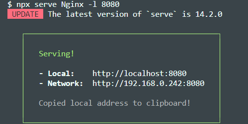
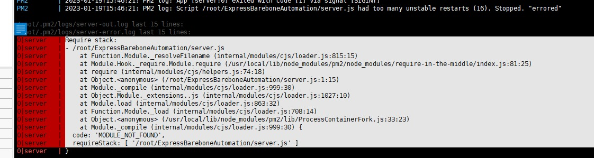
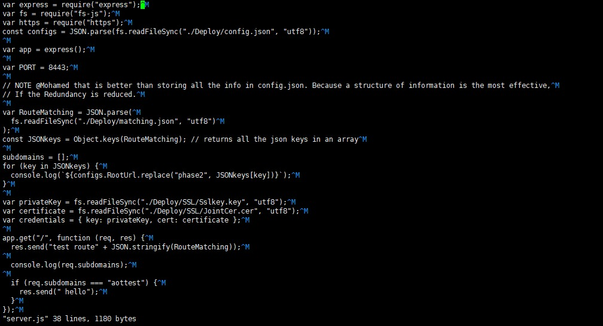

# Progress Notes

[Tutorial: Express and subdomains](https://www.geeksforgeeks.org/express-js-req-subdomains-property/)

[Tutorial: Commenting in python files](https://www.programiz.com/python-programming/docstrings)

This is sort of like a diary describe:

1. What problems you encountered and how you resolved them
2. provide an outlook what could be done better if we had more time, what was successful
3. What did you implement

# local testing with multiple Subdomains

the server can be fired up by running

```
npm run dev
```

The server should now run at a specified port

to fire up a frontend run

```
npx serve <pathTobuild> -l <port>
```



## attach multiple Subdomains in you host file

possible Express will not recognize subdomains. Therefore add host by appending the following to the end of the host file
at `C:\Windows\System32\drivers\etc`
we recommend the following for development:

```
   127.0.0.1       sub1.localhost
   127.0.0.1       sub2.localhost
   127.0.0.1       api.localhost
```

same issue un linux you need to add same lines in /etc/hosts
command:

```
vi /etc/hosts
```

# Testing on linux server

when trying to fire backend server face error like the below


### delete node_modules and package-lock.json

```
rm -rf node_modules
rm -f package-lock.json
```

### clean npm cache

```
npm cache clean --force
```

### install packages

```
npm install
```

also after checking server.js file we found that the server is incorrectly deployed due to windows to Linux difference in saving line-endings:


to fix this remove ^M from all end of lines

// TODO @Mohamed try this by using subprocess and execute like follows:
Another fix is to use git to specify how Line endings should be tracked accouring to [this](https://stackoverflow.com/questions/34610705/git-windows-and-linux-line-endings)
and [the docs](https://docs.github.com/en/get-started/getting-started-with-git/configuring-git-to-handle-line-endings#platform-alpot)

# create nginx configuration file for subdomains

i tried to create the file on the sevrer for each subdomain i faced many issues , so i did the second option and on local machine will create the nginx subdomains and then push to the server . for this i create function nginx_subdomain to do this by using template nginx config file HTTPSNginxConfig.txt and from config.json will get subdomains list and create nginx for each file

# nginx default server

we faced an issue that default sevrer already defined (a duplicate default server for 0.0.0.0:443 in /etc/nginx/sites-enabled/subdomains).
so i modify nginx_subdomain function to make only first subdomain config file with default_server parameter and don't add after that .

# Testing:

To test the functionality multiple tests can ensure functionality.

## Backend

Backend must be curlable from the web. This should always continue to work. The project is structured in different phases and each phase has its own repository

Phase

```bash
curl --request GET --url https://KaiserFranz-engineering.de
> Express server response
available subdomains for Frontends:
https://aottest.KaiserFranz-engineering.de https://lgest.KaiserFranz-engineering.de
To access the api use
https://api.KaiserFranz-engineering.de/api
```

## Frontends

For now: The backends are served statically to their respective subdomain using NGINX

```js
curl --request GET --url https://lgtest.Kaiserfranz-engineering.de

curl --request GET --url https://aottest.Kaiserfranz-engineering.de

curl --request GET --url https://aottest.Kaiserfranz-engineering.de:8443
```
